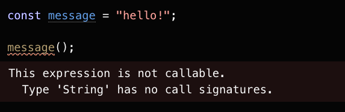

# Dynamic ve Static Typing

**Dynamic typing** value (değer) ile ilgilidir ve tüm tip kontrolleri runtime'da yapılır. Bu sistemde bir değişkene herhangi bir değer atayabilirsiniz. **Static typing** ise variable (değişken) ya da textual expression ile ilgilidir ve compile-time'da, programınızı henüz çalıştırmadan önce kontrol edilir. TypeScript gibi **static type-checker** sistemleri programlar çalıştırıldığında karşılaşabileceğimiz olası hataları bize gösterirler.

### Dynamic Typing

JavaScript ile yazılan kodları çalıştırdığımızda runtime'da kullandığımız değerlerin (values) ne tipte (types) olduğu belirlenir ve bu değerler üzerinde ne tür işlemler yapabileceğimize karar verilir. Sık sık karşılaştığımız `TypeError` hatalarının bir kaynağı da budur. `string` ya da `number` gibi primitive değerler için `typeof` operatörü ile tipleri belirleyebilsek de `fonksiyonlar` gibi diğer durumlarda tipleri belirlememiz mümkün değil.

JavaScript bize yalnızca **dynamic typing** (dinamik tipleme) sistemini sunar.

### Static Typing

Typescript'i bu bahsettiğimiz `TypeError` hatalarını henüz kodlarımızı çalıştırmadan önce bizim için fark edip gösterebilecek ve potansiyel hataların önüne geçebilecek bir **static type-checker** olarak düşünebilirsiniz. Şu örnekteki gibi bir `string` değerini çağırmaya çalıştığınızda daha kodunuzu çalıştırmadan önce hata mesajını verecektir.

## Neden Static Typing?

* Static typing tam anlamıyla hataların önüne geçmenizi sağlamaz ancak onları daha erken fark edip düzeltebilmenizi, bu sayede uzun vadede daha az efor harcamanıza yardımcı olur.

* Type annotationlar yazılan kod git gide detaylanıp daha karmaşık bir hale başladığında parçalara ayırma konusunda yardımcı olur. 

* Eklenen tüm type annotationlar kendiliğinden bir tür teknik doküman olarak kullanılabilir ve ekibe yeni dahil olan geliştiricilerin projeye adapte olma süreçlerini daha kolay hale getirebilir.

#### Kaynaklar

[JS interview in 2 minutes / Static vs Dynamic typing - dev.to](https://dev.to/kozlovzxc/js-interview-in-2-minutes-static-vs-dynamic-typing-2d5k)

[TypeScript: Static or Dynamic? The war is over. - Medium](https://itnext.io/typescript-static-or-dynamic-64bceb50b93e)

[The Basics - TypeScript Handbook](https://www.typescriptlang.org/docs/handbook/2/basic-types.html)

[Dynamic Static Typing In TypeScript - Smashing Magazine](https://www.smashingmagazine.com/2021/01/dynamic-static-typing-typescript/)