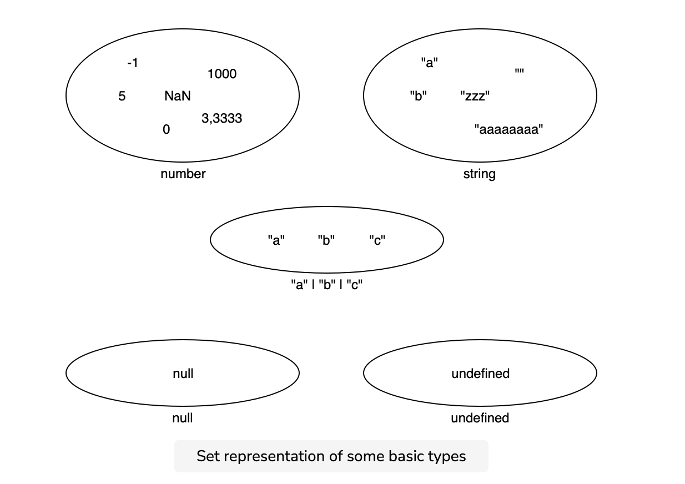
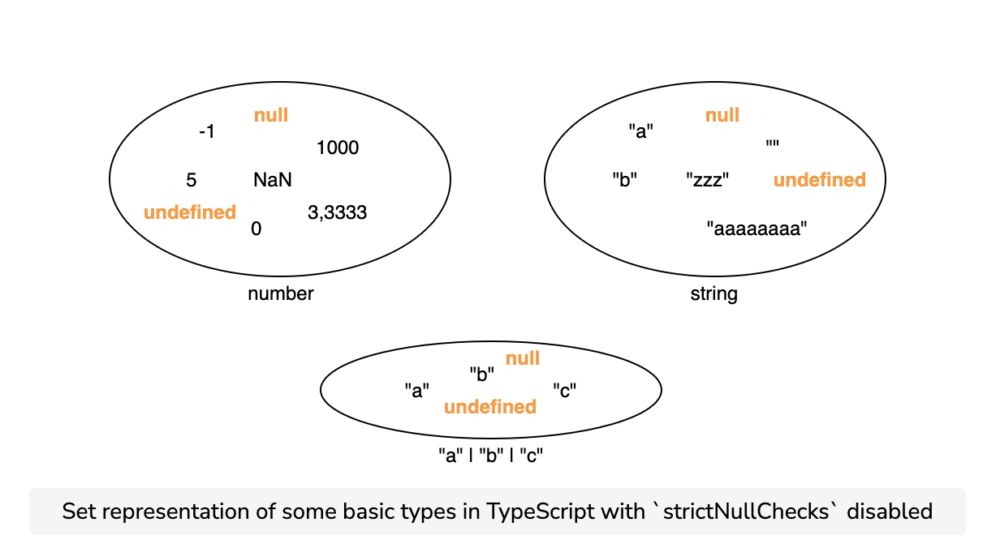

# Null ve Undefined

Javascript'te bir değerin *var olmadığını* ya da *initialized edilmemiş* olduğunu ifade etmek için iki primitive değer kullanılırız: `null` ve `undefined`.

Typescript'te de bu isimlerde iki tip vardır. Ancak bu tiplerin nasıl davranacağı `strictNullChecks` kuralınının geçerli olup olmamasına göre değişir. 

## strictNullChecks 

`strictNullChecks` eğer `false` ise, `null` ve `undefined` dil tarafından görmezden gelinecektir. Bu runtime içerisinde beklenmedik hatalara sebep olabilir. Oluşturulan değerler hala erişebilir olduğundan herhangi bir tip özelliklerini alabilirler. Bu durum `null` kontrolü yapmayan dillerin (C#, Java vs.) davranışlarına benzer. Olası hatalar sebebi ile codebase için aksi bir durum ihtiyacı olmadığı sürece bu kuralın açık olması tavsiye edilir.

`strictNullChecks` true değerinde ise `null` ve `undefined` kendi tiplerine sahip olacaktır ve somut bir değer beklendiğinde `type error` hatası verilecektir.

Strict null check modunda `null` ve `undefined` değerleri sadece kendilerine ya da `any` tipine assign edilebilirler (`undefined`'ın `void`'e de assign edilebilme durumu vardır). 



Peki `strictNullChecks` false olursa nasıl olur:



Bu istediğimiz bir şey değil. Bu değeri `null` ya da `undefined` olan bir değere erişebileceğimiz anlamına gelir.

```bash
interface Person {
  hello(): void;
}

const n: number = undefined;
const f: string = null;
const person: Person = null;

person.hello(); // 🔴 Runtime Error!
```

`strictNullChecks` `true` olduğunda TypeScript, bu değerleri içermeyen bir tip gerektiğinde `null` veya `undefined` kullanmanıza izin vermez.

```bash
interface Person {
  hello(): void;
}

function foo(person: Person) {
  person.hello();
}
foo(null); // 🔴 Error!

function bar(person: Person | null) {
  person.hello(); // 🔴 Error!
  if (person !== null) {
    person.hello();
  }
}
bar(null); // OK
```

### Kaynaklar

[Advanced TypeScript Master Class - educative.io](https://www.educative.io/courses/advanced-typescript-masterclass/qVy47ZZKrNG) 👌🏻

[strictNullChecks - Best Practices - TS Mean](https://www.tsmean.com/articles/learn-typescript/strict-null-checks-best-practice/)

[null and undefined - TypeScript Handbook](https://www.typescriptlang.org/docs/handbook/2/everyday-types.html#null-and-undefined)
